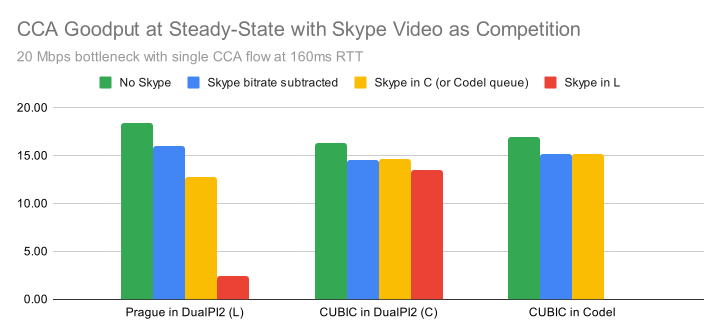
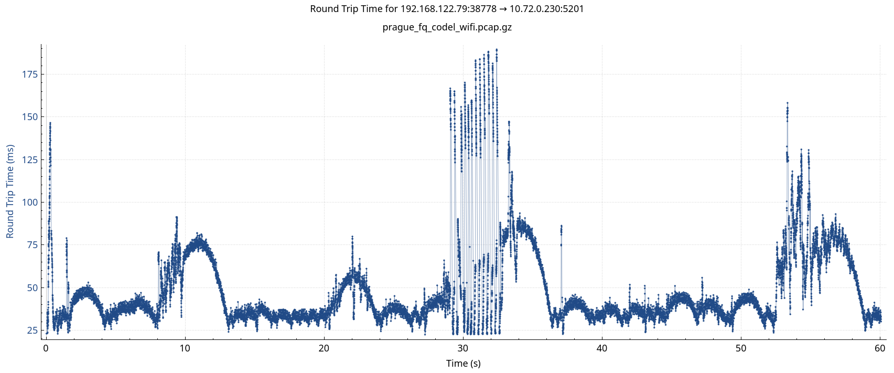
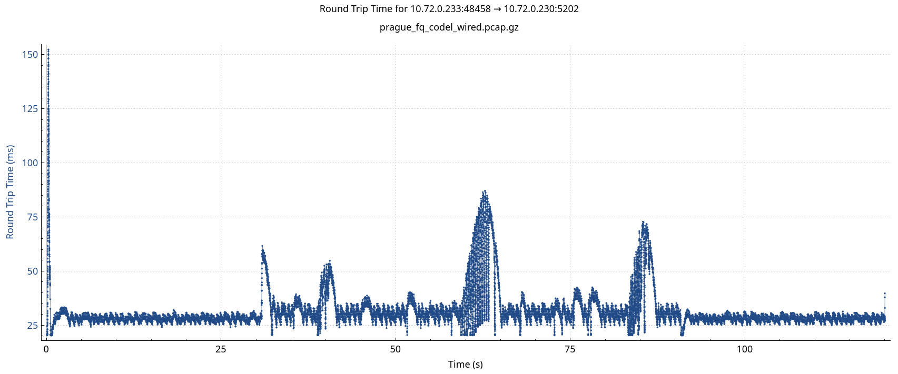
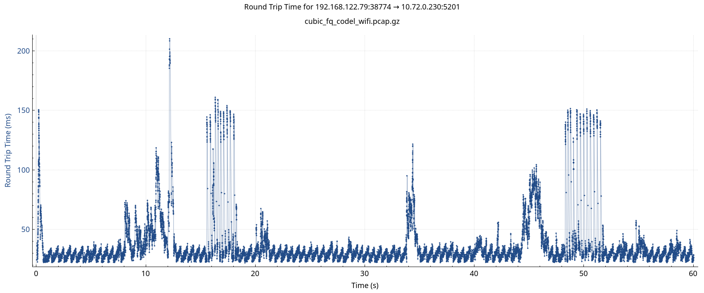
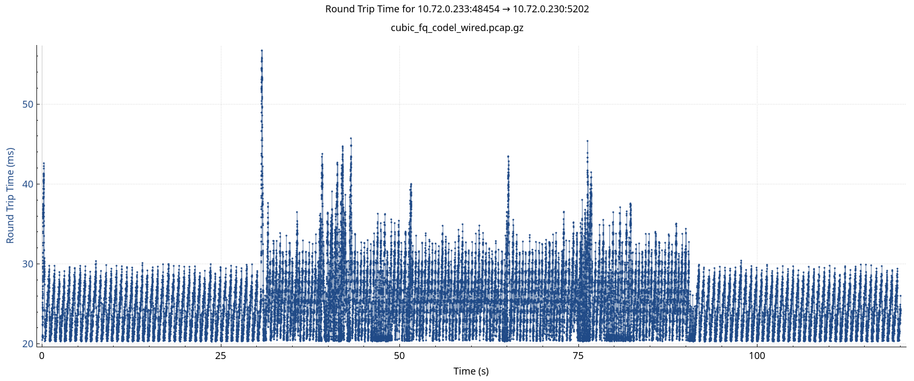
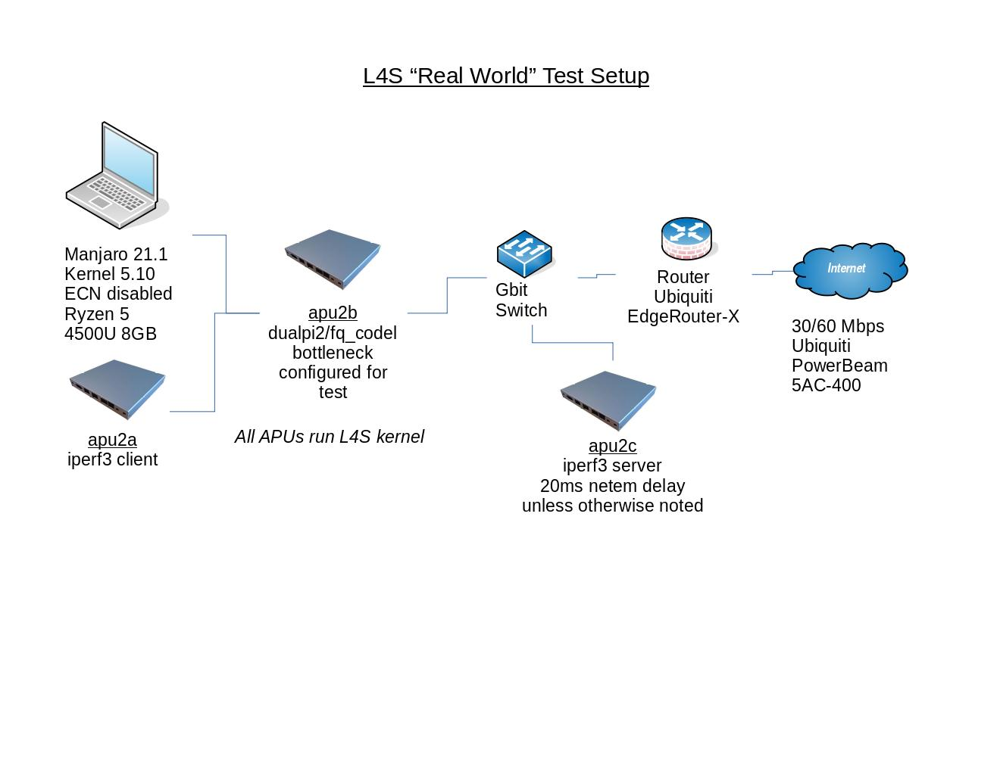
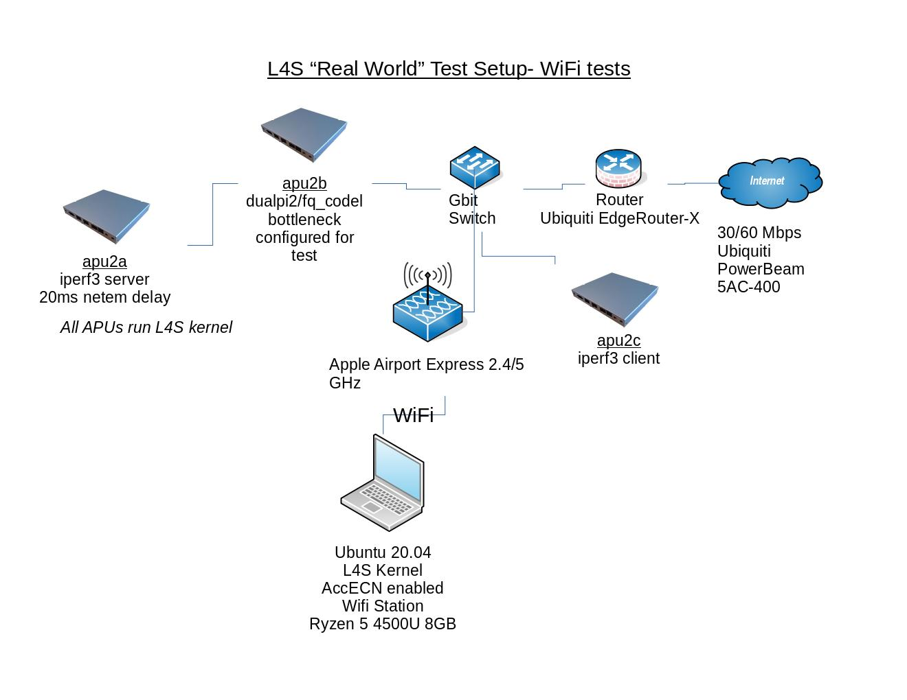

# L4S Tests

Tests of L4S

Pete Heist  
Jonathan Morton  

## Table of Contents

1. [Introduction](#introduction)
2. [Key Findings](#key-findings)
3. [Elaboration on Key Findings](#elaboration-on-key-findings)
   1. [Unsafety in Shared RFC3168 Queues](#unsafety-in-shared-rfc3168-queues)
   2. [Tunneled Non-L4S Flows Not Protected by FQ](#tunneled-non-l4s-flows-not-protected-by-fq)
   3. [Network Bias](#network-bias)
   4. [RTT Unfairness](#rtt-unfairness)
   5. [Between-Flow Induced Delay](#between-flow-induced-delay)
   6. [Underutilization with Bursty Traffic](#underutilization-with-bursty-traffic)
   7. [Intra-Flow Latency Spikes](#intra-flow-latency-spikes)
   8. [Burst Intolerance](#burst-intolerance)
   9. [Dropped Packets for Tunnels with Replay Protection Enabled](#dropped-packets-for-tunnels-with-replay-protection-enabled)
4. [Risk Assessment](#risk-assessment)
   1. [Severity](#severity)
   2. [Likelihood](#likelihood)
5. [Full Results](#full-results)
   1. [Scenario 1: RTT Fairness](#scenario-1-rtt-fairness)
   2. [Scenario 2: Codel Rate Step](#scenario-2-codel-rate-step)
   3. [Scenario 3: Codel Variable Rate](#scenario-3-codel-variable-rate)
   4. [Scenario 4: Bi-directional Traffic, Asymmetric Rates](#scenario-4-bi-directional-traffic-asymmetric-rates)
   5. [Scenario 5: Tunnels](#scenario-5-tunnels)
   6. [Scenario 6: RFC3168 AQMs](#scenario-6-rfc3168-aqms)
6. [Appendix](#appendix)
   1. [Scenario 1 Fairness Table](#scenario-1-fairness-table)
   2. [Scenario 6 Fairness Table](#scenario-6-fairness-table)
   3. [Background](#background)
   4. [Test Setup](#test-setup)

## Introduction

The Transport Area Working Group
([TSVWG](https://datatracker.ietf.org/group/tsvwg/about/)) is working on
[L4S](https://riteproject.eu/dctth/),
which proposes to use the available ECT(1) codepoint for two purposes:

* to redefine the existing CE codepoint as a high-fidelity congestion control
  signal, which is incompatible with the present definition of CE in
  [RFC3168](https://tools.ietf.org/html/rfc3168) and
  [RFC8511](https://tools.ietf.org/html/rfc8511)
* as a PHB (per-hop behavior) to select alternate treatment in bottlenecks

These tests evaluate some aspects of L4S's safety and performance.

Readers wishing for a quick background in high-fidelity congestion control
may wish to read the [Background](#background) section, while those already
familiar with the topic can proceed to the [Key Findings](#key-findings).

## Key Findings

1. [Unsafety in Shared RFC3168 Queues](#unsafety-in-shared-rfc3168-queues):
   L4S flows dominate non-L4S flows, whether ECN enabled or not, when they
   occupy a shared [RFC3168](https://tools.ietf.org/html/rfc3168) signaling
   queue. 
2. [Tunneled Non-L4S Flows Not Protected by FQ](#tunneled-non-l4s-flows-not-protected-by-fq):
   Tunnels are a path to the result in Key Finding #1 at FQ bottlenecks like
   fq_codel.
3. The
   [DualPI2](https://datatracker.ietf.org/doc/draft-ietf-tsvwg-aqm-dualq-coupled/)
   qdisc introduces a [network bias](#network-bias) for TCP Prague flows over
   existing CUBIC flows.
4. TCP Prague and DualPI2 exhibit a greater level of
   [RTT unfairness](#rtt-unfairness) than the presently used CUBIC and pfifo.
5. Bursty traffic in the L queue from applications such as videoconferencing
   can cause [between-flow induced delay](#between-flow-induced-delay)
   that far exceeds the sub 1ms ultra-low latency goal.
6. Bursty traffic in both the L **and C** queues can cause
   [underutilization](#bursty-traffic-underutilization) for flows in L.
7. L4S transports experience
   [intra-flow latency spikes](#intra-flow-latency-spikes) at RFC3168
   bottlenecks, particularly with the widely deployed fq_codel.
8. The marking scheme in the DualPI2 qdisc is
   [burst intolerant](#burst-intolerance), causing under-utilization for
   traffic with bursty arrivals.
9. [Tunnels may drop packets that traverse the C queue](#dropped-packets-for-tunnels-with-replay-protection-enabled)
   when [anti-replay](https://en.wikipedia.org/wiki/Anti-replay) is enabled,
   leading to harm to classic traffic and enabling a DoS attack.

## Elaboration on Key Findings

### Unsafety in Shared RFC3168 Queues

When L4S and non-L4S flows are in the same queue signaled by an
[RFC3168](https://tools.ietf.org/html/rfc3168) AQM, the L4S flows can dominate
non-L4S flows that use a conventional cwnd/2 response to CE and drop, regardless
of whether the non-L4S flows are ECN capable.

The reason is that the L4S and RFC3168 responses to CE are incompatible. L4S
flows expect high-frequency CE signaling, while non-L4S flows expect
low-frequency CE signaling or drops. Not-ECT flows (flows not supporting ECN)
are also dominated by L4S flows, because the AQM similarly drops packets for
these flows instead of signaling CE.

See the [Risk Assessment](#risk-assessment) section for a discussion on the
risks posed by this issue.

#### Harm to TCP Flows

*Figure 1* shows Prague vs CUBIC(Non-ECN) through a shared fq_codel queue. Note
that here we use the parameter \`flows 1\` for fq_codel, which simulates traffic
in a shared queue. That happens for
[tunneled traffic](#tunneled-non-l4s-flows-not-protected-by-fq),
when a flow hash collision occurs, or may also happen when the qdisc hash has
been [customized](https://github.com/heistp/qdisc-custom-classification/).

$(plot_inline "fq_codel shared queue, Prague vs CUBIC(Non-ECN)" "l4s-s6-rfc3168" "ns-prague-vs-cubic-noecn-fq_codel_1q_-50Mbit-20ms_tcp_delivery_with_rtt.svg")
*Figure 1*

*Figure 2* shows Prague vs Reno(Non-ECN) through a shared fq_codel queue. Reno
seems to be more apt to be driven to minimum cwnd in these tests.

$(plot_inline "fq_codel shared queue, Prague vs Reno(Non-ECN)" "l4s-s6-rfc3168" "ns-prague-vs-reno-noecn-fq_codel_1q_-50Mbit-20ms_tcp_delivery_with_rtt.svg")
*Figure 2*

*Figure 3* shows Prague vs Reno(ECN) through a shared PIE queue with ECN
enabled.

$(plot_inline "PIE ECN, Prague vs Reno(ECN)" "l4s-s6-rfc3168" "ns-prague-vs-reno-ecn-pie-50Mbit-20ms_tcp_delivery_with_rtt.svg")
*Figure 3*

See the [Scenario 6 Fairness Table](#scenario-6-fairness-table) for the
steady-state throughput ratios of each run.

See the [Scenario 6](#scenario-6-rfc3168-aqms) results for fq_codel, PIE and
RED, each with two different common configurations.

#### Harm to Video Streaming Services

Using a [real world test setup](#real-world-tests), we looked at the harm that
TCP Prague can do in shared RFC3168 queues to video streaming services, relative
to the harm done by CUBIC. In each test, there is two minutes of competition
each with both CUBIC and Prague, with one minute of no competition before, after
and in-between.

Here are the results:

| Service | Protocol | Bottleneck Bandwidth | CUBIC Throughput (Harm) | Prague Throughput (Harm) | Results |
| ------- | -------- | -------------------- | ----------------------- | ------------------------ | ------- |
| YouTube | QUIC (BBR?) | 30 Mbps | 7.8 Mbps (none apparent) | 19 Mbps (resolution reduction, 2160p to 1440p) | [mp4](https://sce.dnsmgr.net/results/l4s-video/youtube_30mbps_fq_codel_flows_1.mp4), [pcap](https://sce.dnsmgr.net/results/l4s-video/youtube_30mbps_fq_codel_flows_1.pcap.gz) |
| O2TV | HTTP/TCP (unknown CCA) | 20 Mbps | 16 Mbps (none apparent) | 19 Mbps (two freezes, quality reduction) | [mov](https://sce.dnsmgr.net/results/l4s-video/o2tv_volleyball_20mbps_fq_codel_flows_1.mov), [pcap](https://sce.dnsmgr.net/results/l4s-video/o2tv_volleyball_20mbps_fq_codel_flows_1.pcap.gz) |
| SledovaniTV | HTTP/TCP (unknown CCA) | 5 Mbps | 3.9 Mbps (none apparent) | 4.6 Mbps (persistent freezes, quality reduction) | [mp4](https://sce.dnsmgr.net/results/l4s-video/sledovanitv_5mbps_fq_codel_flows_1.mp4), [pcap](https://sce.dnsmgr.net/results/l4s-video/sledovanitv_5mbps_fq_codel_flows_1.pcap.gz) |

The above results suggest that the harm that L4S flows do in shared RFC3168
queues goes beyond just unfairness towards long-running flows. They also show
that YouTube (which appears to use BBR) is significantly less affected than O2TV
or SledovaniTV (which appear to use conventional TCP). This may be because BBR's
response to CE and drop differ from conventional TCP. Thus, it would seem that
video streaming services using CUBIC or Reno are likely to be more affected than
those using BBR.

Note that the SledovaniTV service uses a lower bitrate for its web-based
streams, so a low bottleneck bandwidth was required for an effective comparison.
This may not be as common a bottleneck bandwidth anymore, but can still occur in
low rate ADSL or WiFi.

#### Harm to Short TCP Flows

Using a standalone test program, FCT (flow completion time) tests were
performed. Those results are
[here](https://github.com/heistp/ccafct#sample-output).

In the test, a series of short CUBIC flows (with lengths following a lognormal
distribution) were run first with no competition, then with a long-running CUBIC
flow, then with a long-running Prague flow. FCT
[Harm](https://www.cs.cmu.edu/~rware/assets/pdf/ware-hotnets19.pdf) was
calculated for each result.

### Tunneled Non-L4S Flows Not Protected by FQ

Related to the
[unsafety in shared RFC3168 queues](#unsafety-in-shared-rfc3168-queues), when
traffic passes through a tunnel, its encapsulated packets usually share the
same 5-tuple, so inner flows lose the flow isolation provided by FQ bottlenecks.
This means that when tunneled L4S and non-L4S traffic traverse the same
[RFC3168](https://tools.ietf.org/html/rfc3168) bottleneck, even when it has FQ,
there is no flow isolation to maintain safety between the flows.

In practical
terms, the result is that L4S flows dominate non-L4S flows in the same tunnel
(e.g. [Wireguard](https://www.wireguard.com/) or
[OpenVPN](https://en.wikipedia.org/wiki/OpenVPN)), when the tunneled traffic
passes through fq_codel or CAKE qdiscs.

See the [Risk Assessment](#risk-assessment) section for a further discussion
on this issue.

Here is a common sample topology:

\`\`\`
    -------------------    ------------    -------------------
    | Tunnel Endpoint |----| fq_codel |----| Tunnel Endpoint |
    -------------------    ------------    -------------------
\`\`\`

In *Figure 10* below, we can see how an L4S **Prague** flow (the red trace)
dominates a standard **CUBIC** flow (the blue trace) in the same
[Wireguard](https://www.wireguard.com/) tunnel:

$(plot_inline "wireguard Tunnel, Prague vs CUBIC" "l4s-s5-tunnel" "phys-wireguard-prague-vs-cubic-fq_codel-50Mbit-20ms_tcp_delivery_with_rtt.svg")  
*Figure 10*

See [Unsafety in Shared RFC3168 Queues](#unsafety-in-shared-rfc3168-queues)
for more information on why this happens and what the result is.

See [Scenario 5](#scenario-5-tunnels) in the Appendix for links to these
results, which are expected to be similar with most any tunnel.

*Note #1* In testing this scenario, it was discovered that the [Foo over
UDP](https://lwn.net/Articles/614348/) tunnel has the ability to use an
automatic source port (\`encap-sport auto\`), which restores flow isolation by
using a different source port for each inner flow. However, this is tunnel
dependent, and secure tunnels like VPNs are not likely to support this option,
as doing so would be a security risk.

*Note #2* Also in testing, we found that when using a netns (network namespaces)
environment, the Linux kernel (5.4 at least) tracks a tunnel's inner flows even
as their encapsulated packets cross namespace boundaries, making the results not
representative of what typically happens in the real world. Flows not only get
their own hash, but that hash can actually change across the lifetime of the
flow, resulting in an unexpected AQM response. To avoid this problem, make sure
the client, middlebox and server all run on different kernels when testing
tunnels, as would be expected in the real world.

### Network Bias

$(chart_inline "L4S Network Bias 20ms" "s1-charts" "rttfair_cc_qdisc_20ms_20ms.svg")
*Figure 1*

Measurements show that DualPI2 consistently gives TCP Prague flows a throughput advantage over conventional CUBIC flows, 
where both flows run over the same path RTT.  In *Figure 1* above, we compare the typical status quo in the form of a 
250ms-sized dumb FIFO (middle) to DualPI2 (left) and an Approximate Fairness AQM (right) which actively considers queue 
occupancy of each flow.  The baseline path RTT for both flows is 20ms, which is in the range expected for CDN to consumer 
traffic.  Both flows start simultaneously and run for 3 minutes, with the throughput figures being taken from the final 
minute of the run as an approximation of reaching steady-state.

It is well-known that CUBIC outperforms NewReno on high-BDP paths where the polynomial curve grows faster than the linear 
one; the 250ms queue depth of the dumb FIFO and the relatively high throughput of the link puts the middle chart firmly in 
that regime.  Because no AQM is present at the bottleneck, TCP Prague behaves approximately like NewReno and, as expected, 
is outperformed by CUBIC.  It is difficult, incidentally, to see where L4S' "scalable throughput" claim is justified here, 
as CUBIC clearly scales up in throughput better in today's typical Internet environment.

L4S assumes that an L4S-aware AQM is present at the bottleneck.  The left-hand chart shows what happens when DualPI2, which 
is claimed to implement L4S in the network, is indeed present there.  In a stark reversal from the dumb FIFO scenario, TCP 
Prague is seen to have a large throughput advantage over CUBIC, in more than a 2:1 ratio.  This cannot be explained by 
CUBIC's sawtooth behaviour, as that would leave much less than 50% of available capacity unused.  We believe that several 
effects, both explicit and accidental, in DualPI's design are giving TCP Prague an unfair advantage in throughput.

The CodelAF results are presented as an example of what can easily be achieved by actively equalising queue occupancy across 
flows through differential AQM activity, which compensates for differing congestion control algorithms and path 
characteristics.  CodelAF was initially developed as part of SCE, but the version used here is purely RFC-3168 compliant.
On the right side of *Figure 2*, you can see that CUBIC and TCP Prague are given very nearly equal access to the link, with 
considerably less queuing than in the dumb FIFO.

$(chart_inline "L4S Network Bias 80ms" "s1-charts" "rttfair_cc_qdisc_80ms_80ms.svg")
*Figure 2*

These results also hold on 10ms and 80ms paths, with only minor variations; most notably, at 80ms CUBIC loses a bit of 
throughput in CodelAF due to its sawtooth behaviour, but is still not disadvantaged to the extent that DualPI2 imposes.  We 
also see very similar results to CodelAF when the current state-of-the-art fq_codel and CAKE qdiscs are used.  Hence we show 
that DualPI2 represents a regression in behaviour from both the currently typical deployment and the state of the art, with 
respect to throughput fairness on a common RTT.  We could even hypothesise from this data that a deliberate attempt to 
introduce a "fast lane" is in evidence here.

### RTT Unfairness

One of the so-called "Prague Requirements" adopted by L4S is to reduce the dependence on path RTT for flow throughput.
Conventional single-queue AQM tends to result in a consistent average cwnd across flows sharing the bottleneck, and since 
BDP == cwnd * MTU == throughput * RTT, the throughput of each flow is inversely proportional to the effective RTT 
experienced by that flow, which in turn is the baseline path RTT plus the queue delay.

However, DualPI2 is designed to perpetuate this equalising of average cwnd, not only between flows in the same queue, but 
between the two classes of traffic it manages (L4S and conventional).  Further, the effective RTT differs between the two 
classes of traffic due to the different AQM target in each, and the queue depth in the L4S class is limited to a very small 
value.  The result is that the ratio of effective RTTs is not diluted by queue depth, as it would be in a deeper queue, and 
also not compensated for by differential per-flow AQM action, as it would be in FQ or AF AQMs which are already deployed to
some extent.

$(chart_inline "L4S RTT Bias 10/160ms" "s1-charts" "rttfair_cc_qdisc_10ms_160ms.svg")
*Figure 3*

This can be clearly seen in *Figure 3* above, in which a comparatively extreme ratio of path RTTs has been introduced between 
two flows to illustrate the effect.  In the middle, the 250ms dumb FIFO is clearly seen to dilute the effect (the effective 
RTTs are 260ms and 410ms respectively) to the point where, except for two CUBIC flows competing against each other, other 
effects dominate the result in terms of steady-state throughput.  On the right, the AF AQM clearly reduces the RTT bias 
effect to almost parity, with the exception of the pair of CUBIC flows which are still slightly improved over the dumb FIFO.  

But on the left, when the bottleneck is managed by DualPI2, the shorter-RTT flow has a big throughput advantage in every 
case - even overcoming the throughput advantage that DualPI2 normally gives to TCP Prague, as shown previously.  Indeed the 
only case where DualPI2 shows better elimination of RTT bias than the dumb FIFO is entirely due to this bias in favour of 
TCP Prague.  Additionally, in the pure-L4S scenario in which both flows are TCP Prague, the ratio of throughput actually 
exceeds the nominal 16:1 ratio of path RTTs.

We conclude that DualPI2 does not represent "running code" supporting the L4S specification in respect of the "reduce RTT 
dependence" element of the Prague Requirements.  Observing that the IETF standardisation process is predicated upon "rough 
consensus and running code", we strongly suggest that this deficiency be remedied before a WGLC process is considered.

### Between-Flow Induced Delay

Between-flow induced delay refers to the delay induced by one flow on another
when they're in the same FIFO queue.

Using a [real world test setup](#real-world-tests), we placed Skype video
traffic (~2.5 Mbps bitrate) in the L queue on both egress and ingress dualpi2
instances at three different bottleneck bandwidths, 5 Mbps, 10 Mbps and 20 Mbps.
Concurrently, we measured RTT through the bottleneck's L queue using
[irtt](https://github.com/heistp/irtt).

The results suggest that the bursty traffic typical of videoconferencing
applications, which would seem to be good candidates for placement in the L
queue, can induce delays that are far greater than the sub 1ms ultra-low latency
goal.

A few notes about the CDF plot in *Figure 5* below:
- The percentages are reversed from what may be expected, e.g. a percentile of
  2% indicates that 98% of the sample were below the corresponding induced
  latency value.
- *Induced latency* is the RTT measurement from irtt, so delay through the L
  queue in each direction can be expected to be approximately half of that.
- fq_codel was also tested at each bandwidth, which just shows the flow
  switching times for FQ, since the measurement flow goes through a separate
  queue.

*Figure 5*

### Underutilization with Bursty Traffic

Using a [real world test setup](#real-world-tests), we placed Skype video
traffic (1.79 Mbps bitrate) in DualPI2(L), DualPI2(C) and Codel queues, and
measured the goodput for CUBIC and Prague, with and without Skype competition.
While the bursty Skype traffic has little impact on conventional AQMs and CCAs,
we see significantly reduced utilization for L4S Prague flows in DualPI2, when
Skype is in either the L queue, or the C queue.

*Figure 6* below uses data from the subsections that follow. Goodput is measured
using relative TCP sequence number differences over time. The theoretical
maximum goodput with Skype is the CCA's goodput without competition, minus 1.79
Mbps for Skype.

*Figure 6*

#### Underutilization with Bursty Traffic (Prague in DualPI2)

With Prague in DualPI2, we see remarkable underutilization with Skype traffic in
L, with a 15.97 Mbps backoff in steady-state goodput in response to 1.79 Mbps of
Skype traffic. Some would argue that bursty traffic must not be placed in L. We
leave it as an exercise for the reader to determine how feasible that is.

We also see significant underutilization with Skype traffic in C, with a 5.63
Mbps backoff in goodput in response to 1.79 Mbps of Skype traffic, when bursts
that arrive in C impact L via the queue coupling mechanism.

| CCA | Qdisc | Skype | Tstart | Tend | State | Goodput (Mbps) | Backoff (Mbps) | Links |
| --- | ----- | ----- | ----------------- | --------------- | ----- | -------------- | -------------- | ----- |
| Prague | DualPI2 | no    | 43.08 | 120 | steady | 18.27 | n/a | ([plot](results/skype/tput/iperf3_dualpi2_prague_20mbps_160ms_tput.png), [pcap](results/skype/tput/iperf3_dualpi2_prague_20mbps_160ms.pcap.gz)) |
| Prague | DualPI2 | yes, in L | 38.13 | 120 | steady | 2.29 | 15.97 | ([plot](results/skype/tput/skype_dualpi2_l_prague_20mbps_160ms_tput.png), [pcap](results/skype/tput/skype_dualpi2_l_prague_20mbps_160ms.pcap.gz)) |
| Prague | DualPI2 | yes, in C | 35.08 | 120 | steady | 12.64 | 5.63 | ([plot](results/skype/tput/skype_dualpi2_c_prague_20mbps_160ms_tput.png), [pcap](results/skype/tput/skype_dualpi2_c_prague_20mbps_160ms.pcap.gz)) |

#### Utilization with Bursty Traffic (CUBIC in DualPI2)

With CUBIC in DualPI2 and Skype traffic in C, CUBIC utilizes the link in full.
With Skype traffic in L, the bursts that arrive in L impact C via the queue
coupling mechanism, reducing CUBIC's utilization somewhat.

CUBIC in DualPI2 sees two distinct phases of operation during steady-state, so
it's divided here into *early* and *late*. We also see a pathological drop in
throughput after slow-start exit visible in the
[time series plot](results/skype/tput/skype_dualpi2_c_cubic_20mbps_160ms_tput.png),
due to an apparent overreaction from PI in combination with the bursty Skype
traffic.

| CCA | Qdisc | Skype | Tstart | Tend | State | Goodput (Mbps) | Backoff (Mbps) | Links |
| --- | ----- | ----- | ----------------- | --------------- | ----- | -------------- | -------------- | ----- |
| CUBIC | DualPI2 | no    | 1.88 | 120 | steady | 16.22 | n/a | ([plot](results/skype/tput/iperf3_dualpi2_cubic_20mbps_160ms_tput.png), [pcap](results/skype/tput/iperf3_dualpi2_cubic_20mbps_160ms.pcap.gz)) |
| CUBIC | DualPI2 | yes, in L | 3.42 | 120 | steady | 13.39 | 2.83 | ([plot](results/skype/tput/skype_dualpi2_l_cubic_20mbps_160ms_tput.png), [pcap](results/skype/tput/skype_dualpi2_l_cubic_20mbps_160ms.pcap.gz)) |
| CUBIC | DualPI2 | yes, in C | 16.29 | 38.67 | steady *(early)* | 13.67 | 2.54 | ([plot](results/skype/tput/skype_dualpi2_c_cubic_20mbps_160ms_tput.png), [pcap](results/skype/tput/skype_dualpi2_c_cubic_20mbps_160ms.pcap.gz)) |
| CUBIC | DualPI2 | yes, in C | 38.67 | 120 | steady *(late)* | 14.77 | 1.45 | ([plot](results/skype/tput/skype_dualpi2_c_cubic_20mbps_160ms_tput.png), [pcap](results/skype/tput/skype_dualpi2_c_cubic_20mbps_160ms.pcap.gz)) |
| CUBIC | DualPI2 | yes, in C | 16.29 | 120 | steady | 14.53 | 1.69 | ([plot](results/skype/tput/skype_dualpi2_c_cubic_20mbps_160ms_tput.png), [pcap](results/skype/tput/skype_dualpi2_c_cubic_20mbps_160ms.pcap.gz)) |

#### Utilization with Bursty Traffic (CUBIC in Codel)

With CUBIC in a single Codel queue, Codel absorbs Skype's bursts with little to
no spurious signalling, allowing CUBIC to fully utilize the available link
capacity.

| CCA | Qdisc | Skype | Tstart | Tend | State | Goodput (Mbps) | Backoff (Mbps) | Links |
| --- | ----- | ----- | ----------------- | --------------- | ----- | -------------- | -------------- | ----- |
| CUBIC | Codel | no    | 1.88 | 120 | steady | 16.86 | n/a | ([plot](results/skype/tput/iperf3_codel_cubic_20mbps_160ms_tput.png), [pcap](results/skype/tput/iperf3_codel_cubic_20mbps_160ms.pcap.gz)) |
| CUBIC | Codel | yes   | 1.98 | 120 | steady | 15.08 | 1.78 | ([plot](results/skype/tput/skype_codel_cubic_20mbps_160ms_tput.png), [pcap](results/skype/tput/skype_codel_cubic_20mbps_160ms.pcap.gz)) |

### Intra-Flow Latency Spikes

Intra-flow latency refers to the delay experienced within a single flow, and for
TCP is typically measured using TCP RTT. Increases in intra-flow latency lead
to:
* longer recovery times for TCP on loss or CE
* delays experienced by the user, for example when HTTP/2 requests are
  multiplexed over a single TCP or QUIC flow that is building a queue.

Due to the redefinition of the CE codepoint
[[l4s-id](https://datatracker.ietf.org/doc/draft-ietf-tsvwg-ecn-l4s-id/)], L4S
transports underreact to CE signals sent by existing
[RFC3168](https://tools.ietf.org/html/rfc3168) AQMs that are not aware of ECT(1)
as the L4S identifier, causing them to inflate queues where these AQMs are
deployed, even when FQ is present. We usually discuss this in the context of
safety for non-L4S flows in the same RFC3168 queue, but the added delay that L4S
flows can induce on themselves in these existing queues is a performance issue.

For a practical example, we can look at the TCP RTT of two TCP Prague flows
through an fq_codel bottleneck, where one sender is using WiFi (see [WiFi
Setup](#real-world-tests-wifi)), and the other Ethernet. WiFi's naturally
varying rates cause varying rates of arrival at the bottleneck, leading to TCP
RTT spikes on rate reductions.

First, the TCP RTT for Prague from the WiFi client:

*Figure 7a- TCP Prague in fq_codel, WiFi client*

and for the corresponding Prague flow from the wired client (also affected as
its available capacity is controlled by fq_codel):

*Figure 7b- TCP Prague in fq_codel, wired client*

This in comparison to how a CUBIC flow from the same WiFi client behaves:

*Figure 8a- TCP CUBIC in fq_codel, WiFi client*

and the corresponding CUBIC flow from a wired client:

*Figure 8b- TCP CUBIC in fq_codel, wired client*

For a more controlled example, let's look at what happens when a standard
**CUBIC** flow experiences a 50% rate reduction in an fq_codel queue, from
50Mbps to 25Mbps (see *Figure 10*).

$(plot_inline "Rate Reduction for CUBIC with fq_codel, 50 -> 25Mbit at 80ms" "l4s-s2-codel-rate-step" "ns-clean-cubic-fq_codel-50Mbit-25mbit-80ms_tcp_delivery_with_rtt.svg")  
*Figure 10*

In *Figure 10* above, we can see a brief spike in intra-flow latency (TCP RTT)
at around T=30, as Codel's estimator detects the queue, and the flow is
signaled to slow down. CUBIC reacts with the expected 50% multiplicative
decrease.

Next, let's look at the result when an L4S **TCP Prague** flow experiences the
same 50% rate reduction (see *Figure 11* below):

$(plot_inline "Rate Reduction for Prague with fq_codel, 50 -> 25Mbit at 80ms" "l4s-s2-codel-rate-step" "ns-clean-prague-fq_codel-50Mbit-25mbit-80ms_tcp_delivery_with_rtt.svg")  
*Figure 11*

Comparing *Figure 10* and *Figure 11*, we can see that the induced latency spike
has a much longer duration for TCP Prague than CUBIC. Note that although the
spike may appear small in magnitude due to the plot scale, 100ms is a
significant induced delay when targets in the L4S queue are around 1ms, and
further, we can see that the spike lasts around 5 seconds. This occurs because
TCP Prague mis-interprets the CE signal as coming from an L4S instead of an
RFC3168 queue. Prague reacts with a small linear cwnd reduction instead of the
expected multiplicative decrease, building excessive queue until Codel's
signaling eventually gets it under control.

The consequences of L4S transports underreacting to RFC3168 CE signals can be
more severe as the rate reductions get larger. See *Figure 12* and *Figure 13*
below for what happens to TCP Prague flows when reduced from 50Mbps to 5Mbps and
1Mbps, respectively. These larger reductions may be encountered, for example, as
wireless devices with fq_codel built into the driver change rates in areas of
intermittent AP coverage.

$(plot_inline "Rate Reduction for Prague with fq_codel, 50 -> 5Mbit at 80ms" "l4s-s2-codel-rate-step" "ns-clean-prague-fq_codel-50Mbit-5mbit-80ms_tcp_delivery_with_rtt.svg")  
*Figure 12*

$(plot_inline "Rate Reduction for Prague with fq_codel, 50 -> 1Mbit at 80ms" "l4s-s2-codel-rate-step" "ns-clean-prague-fq_codel-50Mbit-1mbit-80ms_tcp_delivery_with_rtt.svg")  
*Figure 13*

In *Figure 13* above, we see a latency spike that has exceeded the fixed scale
of our plot. However, a review of the
$(batch_link ".flent.gz file" "l4s-s2-codel-rate-step" "ns-clean-prague-fq_codel-50Mbit-1mbit-80ms.flent.gz")
shows the maximum TCP RTT to be **4346ms**, and we can see that the spike lasts
for over **30 seconds**.

See the [Scenario 3](#scenario-3-codel-variable-rate) results, in
particular for TCP Prague through fq_codel, to look at what happens when
rates vary several times over the course of a flow.

### Burst Intolerance

The default marking scheme used in the DualPI2 L queue begins at a shallow, sub
1 ms threshold, which while effective for keeping queues shorter, causes
excessive marking for bursty packet arrivals. This results in link
under-utilization for the typically bursty Internet traffic. Burstiness can
come from the link layer, for example with WiFi, where bursts of up to about
4ms are sent, or just from cross-flow traffic through shared bottlenecks.

Note that burstiness is distinguished from jitter in general, which is
associated with a variance in inter-packet gaps, but does not necessarily
consist of well-defined bursts of packets at line rate. In any case, both
well-paced and bursty flows can be expected on the Internet.

[Scenario 2](#scenario-2-codel-rate-step) and
[Scenario 3](#scenario-3-codel-variable-rate) both include runs with netem
simulated bursts of approximately 4ms in duration. In *Figure 14*, we can
see how **CUBIC through fq_codel** handles such bursts.

$(plot_inline "Rate Reduction for CUBIC with fq_codel, 50Mbps -> 25Mbps with Bursty Traffic" "l4s-s2-codel-rate-step" "ns-bursty-cubic-fq_codel-50Mbit-25mbit-20ms_tcp_delivery_with_rtt.svg")  
*Figure 14*

Next, in *Figure 15* we see how **TCP Prague through DualPI2** handles the same
bursts:

$(plot_inline "Rate Reduction for Prague with dualpi2, 50Mbps -> 25Mbps with Bursty Traffic" "l4s-s2-codel-rate-step" "ns-bursty-prague-dualpi2-50Mbit-25mbit-20ms_tcp_delivery_with_rtt.svg")  
*Figure 15*

In *Figure 14* and *Figure 15* we can see that the lower TCP RTT of TCP Prague
comes with a tradeoff of about a 50% reduction in link utilization. While this
may be appropriate for low-latency traffic, capacity seeking bulk downloads may
prefer increased utilization at the expense of some intra-flow delay. We raise
this point merely to help set the expectation that maintaining strictly low
delays at bottlenecks comes at the expense of some link utilization for typical
Internet traffic.

### Dropped Packets for Tunnels with Replay Protection Enabled

Two important tsvwg mailing list posts on this issue:
* [L4S & VPN anti-replay interaction: Explanation](https://mailarchive.ietf.org/arch/msg/tsvwg/PEVCuDJfbrel74ud8kNJtmVwhHA/) (explaining the exact mechanics)
* [L4S dual-queue re-ordering and VPNs](https://mailarchive.ietf.org/arch/msg/tsvwg/Qw74KPTghzeqXRbFHdDTg7ETsxM/) (on use of this as a DoS attack vector)

Tunnels that use [anti-replay](https://en.wikipedia.org/wiki/Anti-replay)
may drop packets that arrive outside the protection window after they traverse
the DualPI2 C queue. This can cause reduced performance for tunneled, non-L4S
traffic, and is a safety issue from the standpoint that conventional traffic
in tunnels with replay protection enabled may be harmed by by the deployment
of DualPI2, including IPsec tunnels using common defaults. It also enables a DoS
attack that can halt C queue traffic (see above).

The plots in *Table 1* below show two-flow competition between CUBIC and Prague
at a few bandwidths and replay window sizes, as a way to illustrate what the
effect is and when it occurs. A replay window of 0 means replay protection is
disabled, showing the standard DualPI2 behavior in these conditions. With other
replay window sizes, conventional traffic (CUBIC) can show reduced throughput,
until the window is high enough such that drops do not occur.

| Bandwidth | Replay Window | RTT  | Plot |
| --------- | ------------- | ---- | ---- |
| 10Mbps    | 0             | 20ms | [SVG](http://sce.dnsmgr.net/results/l4s-2020-11-11T120000-final/l4s-s9-tunnel-reordering/l4s-s9-tunnel-reordering-ns-ipsec-replay-win-0-dualpi2-10Mbit-20ms_tcp_delivery_with_rtt.svg)  |
| 10Mbps    | 32            | 20ms | [SVG](http://sce.dnsmgr.net/results/l4s-2020-11-11T120000-final/l4s-s9-tunnel-reordering/l4s-s9-tunnel-reordering-ns-ipsec-replay-win-32-dualpi2-10Mbit-20ms_tcp_delivery_with_rtt.svg)  |
| 10Mbps    | 64            | 20ms | [SVG](http://sce.dnsmgr.net/results/l4s-2020-11-11T120000-final/l4s-s9-tunnel-reordering/l4s-s9-tunnel-reordering-ns-ipsec-replay-win-64-dualpi2-10Mbit-20ms_tcp_delivery_with_rtt.svg)  |
| 20Mbps    | 0             | 20ms | [SVG](http://sce.dnsmgr.net/results/l4s-2020-11-11T120000-final/l4s-s9-tunnel-reordering/l4s-s9-tunnel-reordering-ns-ipsec-replay-win-0-dualpi2-20Mbit-20ms_tcp_delivery_with_rtt.svg)  |
| 20Mbps    | 32            | 20ms | [SVG](http://sce.dnsmgr.net/results/l4s-2020-11-11T120000-final/l4s-s9-tunnel-reordering/l4s-s9-tunnel-reordering-ns-ipsec-replay-win-32-dualpi2-20Mbit-20ms_tcp_delivery_with_rtt.svg)  |
| 20Mbps    | 64            | 20ms | [SVG](http://sce.dnsmgr.net/results/l4s-2020-11-11T120000-final/l4s-s9-tunnel-reordering/l4s-s9-tunnel-reordering-ns-ipsec-replay-win-64-dualpi2-20Mbit-20ms_tcp_delivery_with_rtt.svg)  |
| 100Mbps   | 0             | 20ms | [SVG](http://sce.dnsmgr.net/results/l4s-2020-11-11T120000-final/l4s-s9-tunnel-reordering/l4s-s9-tunnel-reordering-ns-ipsec-replay-win-0-dualpi2-100Mbit-20ms_tcp_delivery_with_rtt.svg)  |
| 100Mbps   | 32            | 20ms | [SVG](http://sce.dnsmgr.net/results/l4s-2020-11-11T120000-final/l4s-s9-tunnel-reordering/l4s-s9-tunnel-reordering-ns-ipsec-replay-win-32-dualpi2-100Mbit-20ms_tcp_delivery_with_rtt.svg)  |
| 100Mbps   | 64            | 20ms | [SVG](http://sce.dnsmgr.net/results/l4s-2020-11-11T120000-final/l4s-s9-tunnel-reordering/l4s-s9-tunnel-reordering-ns-ipsec-replay-win-64-dualpi2-100Mbit-20ms_tcp_delivery_with_rtt.svg)  |
| 100Mbps   | 128           | 20ms | [SVG](http://sce.dnsmgr.net/results/l4s-2020-11-11T120000-final/l4s-s9-tunnel-reordering/l4s-s9-tunnel-reordering-ns-ipsec-replay-win-128-dualpi2-100Mbit-20ms_tcp_delivery_with_rtt.svg)  |
| 100Mbps   | 256           | 20ms | [SVG](http://sce.dnsmgr.net/results/l4s-2020-11-11T120000-final/l4s-s9-tunnel-reordering/l4s-s9-tunnel-reordering-ns-ipsec-replay-win-256-dualpi2-100Mbit-20ms_tcp_delivery_with_rtt.svg)  |

*Table 1*

As an example, *Figure 16* below shows the plot for a 20Mbps bottleneck with a
32 packet window. We can see that throughput for CUBIC is much lower than what
would be expected under these conditions, due to packets drops by anti-replay.

$(plot_inline "L4S: ipsec tunnel (32 packet replay window)" "l4s-s9-tunnel-reordering" "ns-ipsec-replay-win-32-dualpi2-20Mbit-20ms_tcp_delivery_with_rtt.svg")  
*Figure 16*

IPsec tunnels commonly use a 32 or 64 packet replay window as the default (32
for
[strongswan](https://wiki.strongswan.org/projects/strongswan/wiki/Strongswanconf),
as an example). Tunnels using either of these values are affected by this
problem at virtually all bottleneck bandwidths.

To avoid this problem, the replay window should be sufficiently large to at
least allow for the number of packets that can arrive during the maximum
difference between the sojourn times for C and L. Assuming that the sojourn time
through L can sometimes be close to 0, the peak sojourn time through C becomes
the most significant quantity. Under some network conditions (e.g. lower
bandwidths or higher loads), peak C sojourn times can increase to 50ms or
higher. As an example, to account for 100ms peak sojourn times in a 20Mbps link,
a value of at least 166 packets could be used (20,000,000 / 8 / 1500 / (1000 /
100)). Note that some tunnels may only be configured with replay window sizes
that are a power of 2.

Modern Linux kernels have a fixed **maximum** replay window size of 4096
(\`XFRMA_REPLAY_ESN_MAX\` in
[xfrm.h](https://elixir.bootlin.com/linux/latest/source/include/uapi/linux/xfrm.h)).
Wireguard uses a hardcoded value of 8192 with no option for runtime
configuration, increased from 2048 in May 2020 by [this
commit](https://git.zx2c4.com/wireguard-linux/commit/drivers/net/wireguard?id=c78a0b4a78839d572d8a80f6a62221c0d7843135).
Depending on the maximum limit supported by a particular tunnel implementation,
replay protection may need to be disabled for high-speed tunnels, if it's
possible to do so.

Thanks to Sebastian Moeller for reporting this issue.

## Risk Assessment

*Risk = Severity * Likelihood*

To estimate the risk of the reported safety problems, this section looks at
both *Severity* and *Likelihood*.

### Severity

The results reported in
[Unsafety in Shared RFC3168 Queues](#unsafety-in-shared-rfc3168-queues)
indicate a high severity when safety problems occur. Competing flows are
driven to at or near minimum cwnd. Referring to
[draft-fairhurst-tsvwg-cc-05](https://datatracker.ietf.org/doc/draft-fairhurst-tsvwg-cc/), Section 3.2:

> Transports MUST avoid inducing flow starvation to other flows that
> share resources along the path they use.

We have previously defined starvation as "you know it when you see it", a
definition that applies here.

### Likelihood

The only requirement for the reported
[unsafety](#unsafety-in-shared-rfc3168-queues) to occur is congestion in a
shared queue managed by an [RFC3168](https://tools.ietf.org/html/rfc3168) AQM.
That can happen either in a single queue AQM, or for traffic that ends up
in the same queue in an FQ AQM, most commonly by
[tunneled](#tunneled-non-l4s-flows-not-protected-by-fq)
traffic, but also by hash collision, or when the flow hash has been
[customized](https://github.com/heistp/qdisc-custom-classification/).

The non-L4S flow being dominated *does not need to be ECN capable* in order to
be affected.

We consider it from the angle of both deployments and observed signaling. While
the number of deployments suggests the likelihood, the observed signaling on the
Internet may more directly indicate the likelihood.

#### Deployments

It has been suggested that deployment of single-queue
[RFC3168](https://tools.ietf.org/html/rfc3168) AQMs is minimal. We have no data
supporting or denying that.

The [fq_codel](https://tools.ietf.org/html/rfc8290) qdisc has been in the Linux
kernel since version 3.6 (late 2012) and ships with commercial products and open
source projects. It has been integrated into the ath9k, ath10k, mt76 and iwl
WiFi drivers, and is used in Google WiFi and OpenWrt, as well as vendor products
that depend on OpenWrt, such as Open Mesh products. OpenWrt uses fq_codel in the
supported WiFi drivers by default, and Open Mesh products do as well. The
Ubiquiti EdgeMAX and UniFi products use it for their Smart Queueing feature. The
[Preseem](https://preseem.com/qoe-optimized-shaping/) platform uses it for
managing queues in ISP backhauls. 

An earlier tsvwg thread on fq_codel deployments is
[here](https://mailarchive.ietf.org/arch/msg/tsvwg/UyvpwUiNw0obd_EylBBV7kDRIHs/)

Contributions to this section would be useful, including known products,
distibutions or drivers that mark or do not mark by default.

#### Observed Signaling

A previously shared slide deck on observations of AQM marking is
[here](https://www.ietf.org/proceedings/interim-2020-maprg-01/slides/slides-interim-2020-maprg-01-sessa-latency-aqm-observations-on-the-internet-01.pdf). This
reports a "low but growing" level of CE marking.

ECN counter data from a Czech ISP is
[here](https://github.com/heistp/ecn-counters). While the stateless nature of
the counters makes a complete interpretation challenging, both incoming and
outgoing CE marks are observed, however the possibility that some were due
to incorrect usage of the former ToS byte has not been eliminated. Work to
improve the quality of that data is ongoing.

On MacOS machines, the command \`sudo netstat -sp tcp\` may be run to display
ECN statistics, which includes information on observed ECN signaling.

Contributions to this section from various regions and network positions would
be useful.

### Summary

In a typical [risk matrix](https://en.wikipedia.org/wiki/Risk_matrix), the risk
of high severity outcomes such as these leave very little tolerance for the
probability of occurrence. If the reported outcome is not acceptable, then the
tolerance for likelihood is exactly 0. What we can say for sure is that observed
AQM signaling on the Internet is *greater than 0*.

## Full Results

In the following results, the links are named as follows:

- _plot_: the plot svg
- _cli.pcap_: the client pcap
- _srv.pcap_: the server pcap
- _teardown_: the teardown log, showing qdisc config and stats

### Scenario 1: RTT Fairness

$(cli_gen_table s1)

### Scenario 2: Codel Rate Step

$(cli_gen_table s2)

### Scenario 3: Codel Variable Rate

$(cli_gen_table s3)

### Scenario 4: Bi-directional Traffic, Asymmetric Rates

### Scenario 5: Tunnels

$(cli_gen_table s5)

### Scenario 6: RFC3168 AQMs

$(cli_gen_table s6)

## Appendix

### Scenario 1 Fairness Table

RTT fairness competition, **DSS** Delivery rate (throughput) at steady state (mean of 60 second window ending 2 seconds before end of test)

$(<s1_table.md)

### Scenario 6 Fairness Table

RFC3168 AQM tests, **DSS** Delivery rate (throughput) at steady state (mean of 40 second window ending 2 seconds before end of test)

$(<s6_steady_state.md)

### Background

Conventional congestion control is based on the
[AIMD](https://en.wikipedia.org/wiki/Additive_increase/multiplicative_decrease)
(Additive Increase, Multiplicate Decrease) principle.  This exhibits a
characteristic sawtooth pattern in which the congestion window grows slowly,
then reduces rapidly on receipt of a congestion signal.  This was introduced to
solve the problem of congestion collapse.  However, it is incapable of finding
and settling on the ideal congestion window, which is approximately equal to the
bandwidth-delay product (BDP) plus a jitter margin.

High Fidelity Congestion Control is an attempt to solve this problem by
implementing a finer-grained control loop between the network and the transport
layer.  Hence, instead of oscillating around the ideal (at best), the transport
can keep the ideal amount of traffic in the network, simultaneously maximising
throughput and minimising latency.

### Test Setup

#### Flent Tests

The [Flent](https://flent.org/) tests were done using a dumbbell configuration
(client, middlebox and server) using Linux network namespaces. The L4S kernel
tested was
[L4STeam/linux@b256daedc7672b2188f19e8b6f71ef5db7afc720](https://github.com/L4STeam/linux/tree/b256daedc7672b2188f19e8b6f71ef5db7afc720)
(from Aug 4, 2020).

The **fl** script performs the following functions:
- updates itself onto the management server and clients
- runs tests (./fl run), plot results (./fl plot) and pushes them to a server
- acts as a harness for flent, setting up and tearing down the test config
- generates this README.md from a template

#### Real World Tests- Wired

The diagram below shows the setup used for the L4S "real world" wired tests.
[PCEngines APUs](https://pcengines.ch/apu2e4.htm) were used with L4S kernel
[L4STeam/linux@3cc3851880a1b8fac49d56ed1441deef2844d405](https://github.com/L4STeam/linux/tree/3cc3851880a1b8fac49d56ed1441deef2844d405)
(from June 28, 2021).

#### Real World Tests- WiFi

The diagram below shows the setup used for the L4S "real world" WiFi tests.  The
same L4S kernels were used on the APUs as in the wired tests, and an L4S kernel
was also used on the WiFi client (laptop icon). To simulate a realistic
environment, the laptop was about 8 meters from the access point and through one
wall, using a 2.4 GHz channel with naturally varying rates from MCS3 (26 Mbps)
to MCS12 (78 Mbps).

